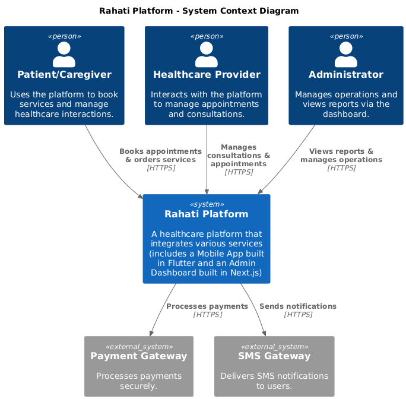
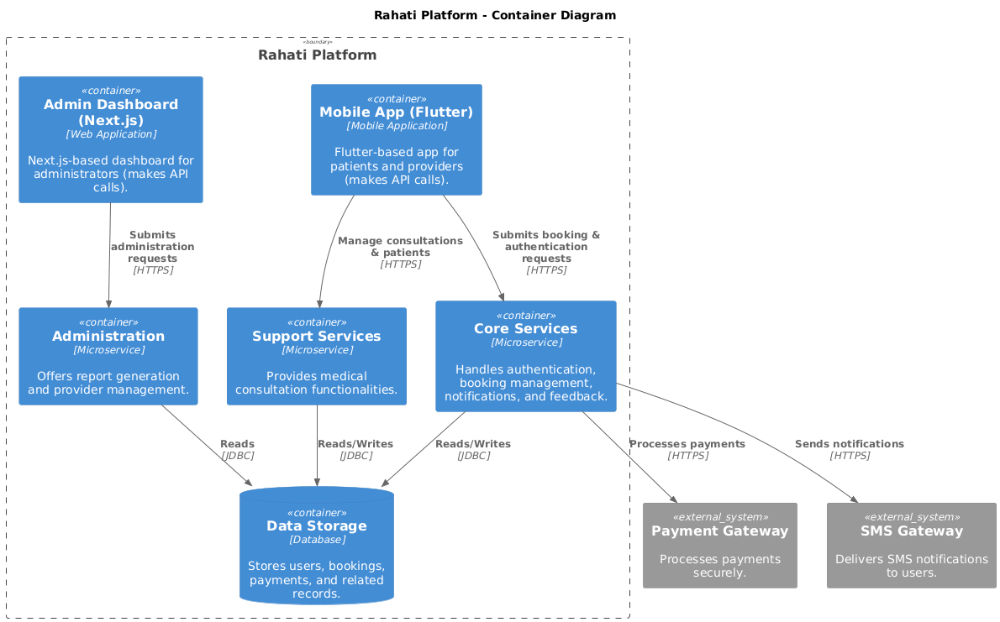
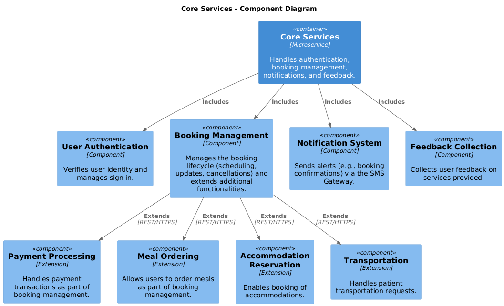
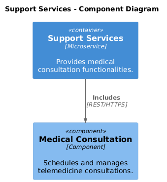
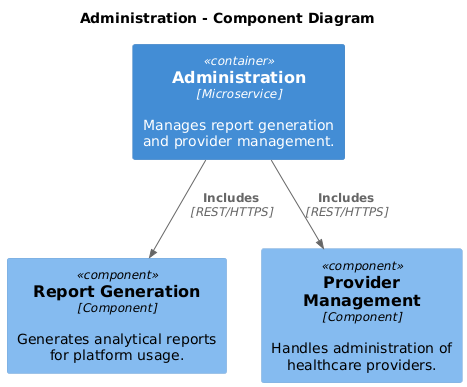
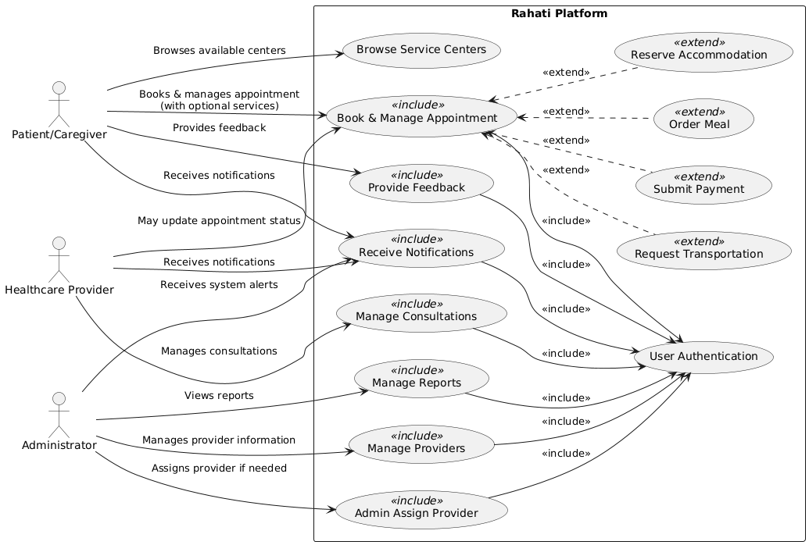

# Rahati Platform Documentation

This repository contains diagrams and documentation for the **Rahati Platform** architecture. Below you will find references to each diagram along with a brief description of its purpose.

## Table of Contents

1. [System Context Diagram](#system-context-diagram)
2. [Container Diagram](#container-diagram)
3. [Core Services Component Diagram](#core-services-component-diagram)
4. [Support Services Component Diagram](#support-services-component-diagram)
5. [Administration Component Diagram](#administration-component-diagram)
6. [Use Case Diagram](#use-case-diagram)
7. [Database Schema (ERD)](#database-schema-erd)

---

## System Context Diagram

The **System Context** diagram provides a high-level overview of the Rahati Platform, showing external systems (e.g., Payment Gateway, SMS Gateway) and the main actors (Patient, Provider, Administrator).

---

## Container Diagram

The **Container** diagram illustrates how the system is broken down into separate containers (e.g., Core Services, Support Services, Administration, Database) and how these containers interact.

---

## Core Services Component Diagram

The **Core Services Component** diagram shows the internal components responsible for handling authentication, booking management, notifications, and other core features.

---

## Support Services Component Diagram

The **Support Services Component** diagram highlights the components that provide medical consultation functionalities and how they integrate with the rest of the platform.

---

## Administration Component Diagram

The **Administration Component** diagram focuses on components that handle provider management, reporting, and administrative tasks within the Rahati Platform.

---

## Use Case Diagram

The **Use Case** diagram provides a functional overview, depicting the various ways actors (patients, providers, admins) interact with the platform’s features (e.g., booking, payment, notifications, reporting).

---

## Database Schema (ERD)

[**View the Rahati Database Schema**](DOCS/Rahati-Database-Schema.png)

The **Entity-Relationship Diagram (ERD)** (in the linked image) represents the logical structure of the Rahati Platform’s database. It shows how entities such as Users, Appointments, Payments, and others relate to each other, along with key fields and relationships.
[Link to Know more..](https://dbdocs.io/yakoubbenaissa7/Rahati-Database-Schema)
---

